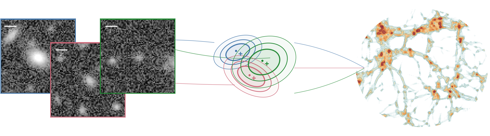
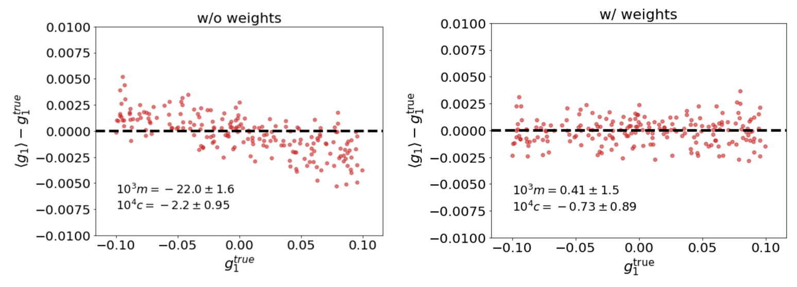
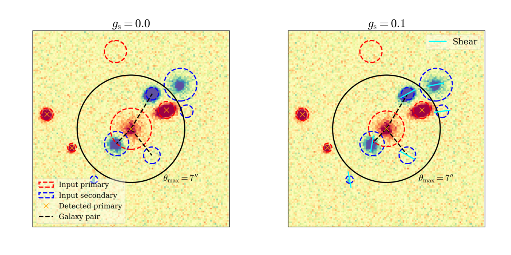
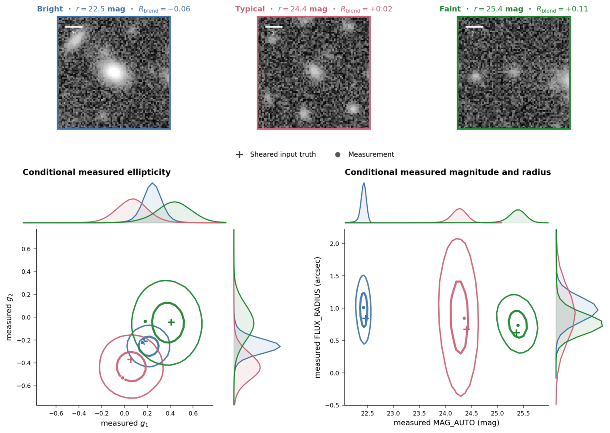
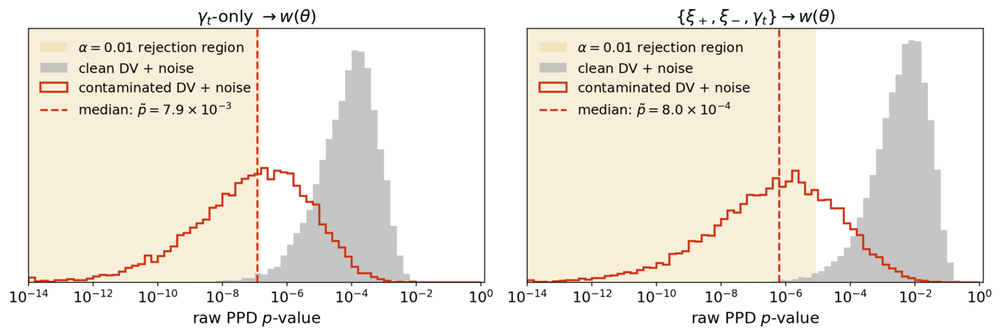

  

<h1 align="center">Zekang Zhang</h1>

  <a href="https://zhangzzk.github.io/">Website</a>
  &nbsp;·&nbsp;
  <a href="mailto:zekang.zhang@physik.lmu.de">Email</a>
  &nbsp;·&nbsp;
  Munich, Germany

I am a PhD researcher at LMU Munich, finishing in 2027. My projects move between pixels, catalogues, modeling and parameter inference. I build
image simulations, machine-learning models, and statistical inference.

I am interested in scientific ML and research roles with simulation,
systematics, and uncertainty.

## Featured projects

### [FORKLENS](https://github.com/zhangzzk/forklens): calibrated image regression

  

FORKLENS uses a two-branch CNN to read a galaxy image and its point-spread
function separately. Small neural networks then calibrate the ensemble and
learn how much weight to give each object.

Paper: [FORKLENS: Accurate weak-lensing shear measurement with deep learning](https://arxiv.org/abs/2301.02986)

### [SBSI](https://github.com/zhangzzk/SBSI) and [BlendEMU](https://github.com/zhangzzk/blendemu): image simulation and Bayesian inference

  

Overlapping objects create a difficult inference problem: a measurement at one
position can contain signal from several sources, and detection itself changes
which objects enter the sample. BlendEMU simulates and measures that process;
SBSI folds the learned response into likelihood-based inference.

  

Paper: [Emulating redshift mixing due to blending in weak gravitational lensing](https://arxiv.org/abs/2507.19130)

### [Skyvar](https://github.com/zhangzzk/skyvar): spatially varying selection

  

Skyvar models the spatial variation of image quality, noise, and extinction across
an observed field. It integrates large catalogues through a learned detection
model, caches sample selection, models spatial correlations, and propagates
the error into parameter inference.

Paper: [Anisotropic redshift distributions in photometric galaxy clustering and their cosmological impact](https://arxiv.org/abs/2609.15542)
